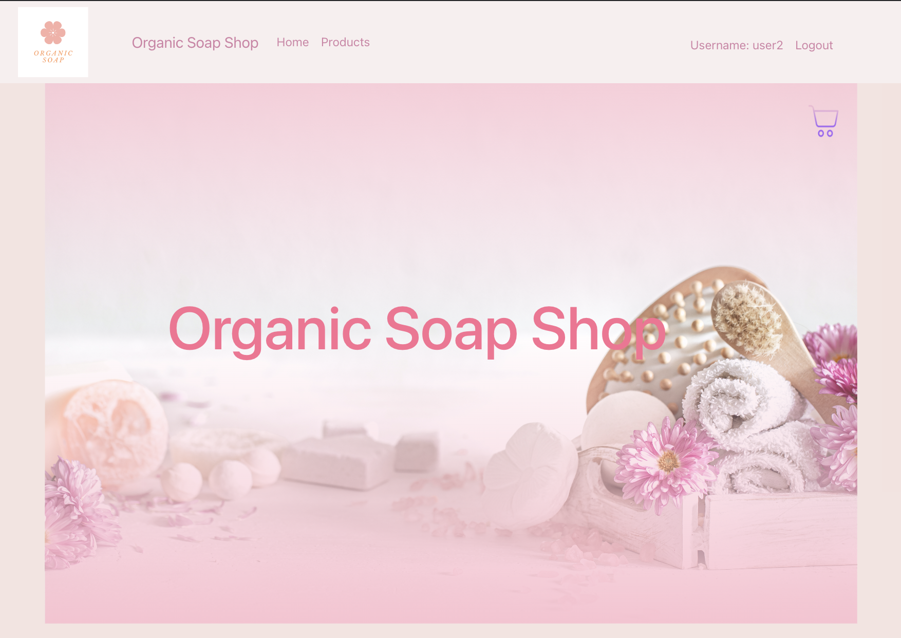

# Soap Online Shop

\*This site is still working on progress.




This is a mock Soap online shop to shop for customers and also inventory management for this soap online company.

I am applying my knowledges and creating this site.

## Technologies

Frontend: JavaScript(React)
Backend: Java(Spring Boot)
Database: Progres DB

## Installation

```bash
git clone https://github.com/makikovaughan/onlineShop.git
```

Open Eclipse or IntelliJ and open soapShop folder.
<br/>
Reload Maven <br/>
Start backend.

```bash
cd online-shop
npm install
npm start
```

## License

Makiko Vaughan
